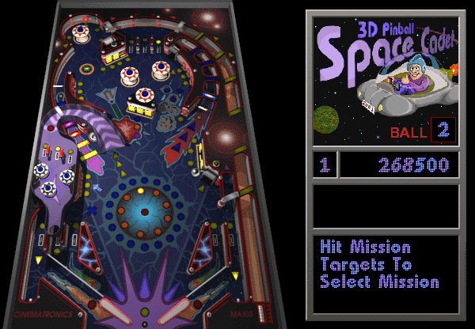
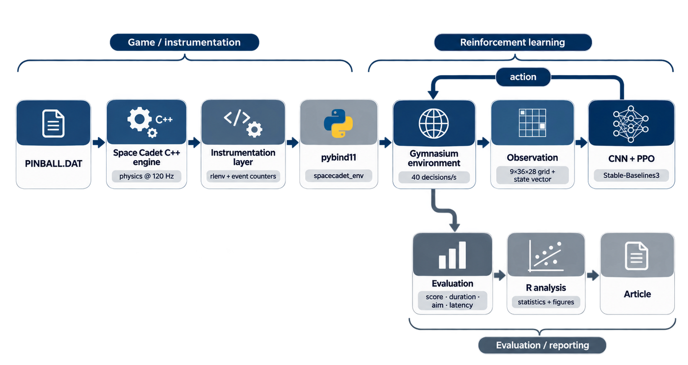
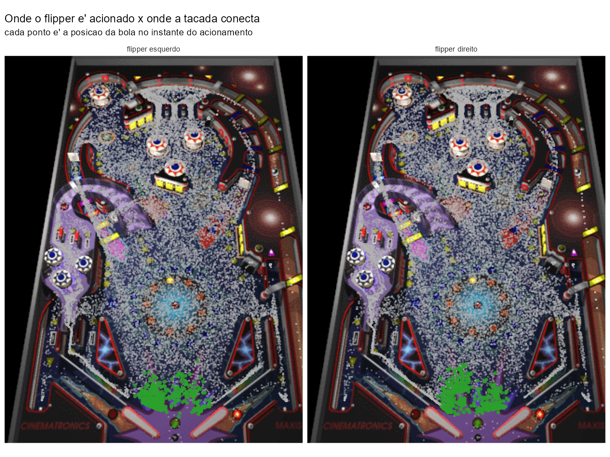

# Teaching an RL Agent to Play 3D Pinball Space Cadet

*Instrumenting the original C++ game to study what an RL agent actually learns.*



| | |
|---|---|
| **2.6M** | median score, unlimited-time games |
| **4.3x** | a random policy |
| **0.62x** | that same random policy, once actions carry 250 ms of latency |

That third number is the point of the project. The agent looks strategic until
you delay its actions by a human-scale reaction time, and then it loses to
pressing buttons at random. Its edge is high-frequency reactive control, not
strategy.

## What I built

The Windows XP pinball game has a [C++ decompilation](https://github.com/k4zmu2a/SpaceCadetPinball)
that compiles and runs. Instead of screen-scraping it, I instrumented it:



<!-- Fonte editavel do diagrama acima, caso precise ser refeito:

flowchart LR
flowchart LR
    DAT[PINBALL.DAT] --> GAME[Space Cadet C++ engine<br/>physics @ 120 Hz]
    GAME --> INST[Instrumentation layer<br/>rlenv + event counters]
    INST --> PYB[pybind11<br/>spacecadet_env]
    PYB --> ENV[Gymnasium environment<br/>40 decisions/s]
    ENV --> OBS[Observation<br/>9x36x28 grid + state vector]
    OBS --> PPO[CNN + PPO<br/>Stable-Baselines3]
    PPO -->|action| ENV
    ENV --> EVAL[Evaluation<br/>score · duration · aim · latency]
    EVAL --> R[R analysis<br/>statistics + figures]
    R --> PAPER[Article]
-->

1. **[C++ hooks](cpp/README.md)** into the physics loop expose ball position,
   velocity, score and per-event counters (bumpers, ramps, medal targets,
   flipper strikes).
2. **pybind11** bindings surface that state to Python as a normal module.
3. A **Gymnasium environment** wraps it, with the table rendered as a 9x36x28
   grid plus a state vector.
4. **PPO** from Stable-Baselines3 trains against it.

The physics runs headless at up to **941x real time**; a full 2.5M-step training
run takes about an hour, roughly **17x real time** end to end.

## Main finding



The base agent connects with the ball on only **2.3%** of its flipper presses.
Several training-side interventions failed to improve that: penalising presses,
rewarding strikes, potential-based shaping, curiosity bonuses, a ball
curriculum, 3x longer training.

Two things did improve aim. **Action masking** raised the hit rate 20-35x, by
forbidding the flipper outside the region where it can actually reach the ball.
**Trajectory prediction** raised it 16.6% (p = 0.0008). Neither improved the
score.

That contradiction is the finding. Across all seven trained agents, **the
ranking by score is identical to the ranking by episode duration**. In this game
the table scores the points; the flippers only keep the ball alive, and a raised
flipper works as a wall that needs no timing at all.

**[Read the full story (PT-BR, 13 pages) →](https://driano1221.github.io/space-cadet-rl/)**

The PDF also lives in this repository, at [docs/artigo.pdf](docs/artigo.pdf).

## Running it

You need the original `PINBALL.DAT` from a Windows XP install. It is not
redistributable and not included here.

```bash
git clone https://github.com/driano1221/space-cadet-rl
cd space-cadet-rl

# 1. the instrumented engine lives in its own repo, as a branch of the
#    decompilation, so the diff against upstream stays readable
git clone -b rl-instrumentation \
  https://github.com/driano1221/SpaceCadetPinball.git SpaceCadetPinball

# 2. build it WITH the Python module (off by default)
pip install pybind11
cd SpaceCadetPinball
cmake -S . -B build -DBUILD_PYTHON_MODULE=ON \
      -Dpybind11_DIR="$(python -m pybind11 --cmakedir)"
cmake --build build --config Release
cd ..

# 3. put your PINBALL.DAT next to the built module
cp /path/to/PINBALL.DAT SpaceCadetPinball/bin/

# 4. Python side
pip install -r requirements.txt

# 5. train (about 1h on a laptop GPU)
python scripts/train.py --config configs/trajectory.yaml

# 6. evaluate
python scripts/evaluate.py --model ppo_trajectory --episodes 10

# 7. regenerate the figures backed by the published data (all but the
#    saliency map, whose per-channel values are not in the CSVs)
Rscript analise/install_packages.R
Rscript scripts/reproduce_figures.R
```

Trained policies are **not** in the repository (about 10 MB each). Train one
with step 5, or grab `ppo_c9_prever.zip` from the
[latest release](https://github.com/driano1221/space-cadet-rl/releases).

The main final-round training variants have configs in [`configs/`](configs):
`baseline`, `trajectory`, `potential_shaping`, `novelty`, `ball_curriculum`,
`progress_shaping`.

## Repository layout

```
cpp/              readable copy of the C++ instrumentation layer
python/           Gymnasium env, CNN, training and measurement scripts
analise/          R analysis, figures, evaluation data
scripts/          user-facing entry points (train, evaluate, figures)
configs/          one YAML per experiment in the article
data/paper/       the exact data behind the article's figures
artigo/           source of the 13-page article
docs/             the PDF, its assets and the GitHub Pages redirect
notes/            design decisions, plus archived development notes
SpaceCadetPinball/  the instrumented fork (cloned locally, gitignored)
```

Every field in the evaluation data is documented in the
**[data dictionary](docs/data-dictionary.md)**, including units, provenance and
the traps (which counters are cumulative, which is a balance, why two normalised
axes must not be combined into a distance).

## Method notes

Each treatment was trained **once**, with a fixed seed, and evaluated on 10
complete episodes. That characterises the trained policy well but does not
substitute for independent training runs; read causal claims as "in this run,
holding everything else fixed". The p-values are exploratory and not corrected
for multiple comparisons.

Evaluations run back to back in the same process, since variance between
separate runs reaches 40%. Comparisons use Mann-Whitney; episodes do not share
seeds, so these are not paired tests.

## Acknowledgements

- [k4zmu2a/SpaceCadetPinball](https://github.com/k4zmu2a/SpaceCadetPinball),
  the decompilation this whole project rests on (MIT)
- Schulman et al., [Proximal Policy Optimization](https://arxiv.org/abs/1707.06347)
  (2017), and [Stable-Baselines3](https://github.com/DLR-RM/stable-baselines3)
  for the implementation
- Ng, Harada and Russell, *Policy Invariance Under Reward Transformations*
  (1999), for potential-based shaping
- [ViZDoom](https://arxiv.org/abs/1605.02097), which established instrumenting
  open-source games for RL back in 2016
- *Pinbot: Applying Reinforcement Learning to Pinball Machines* (CMU 16-831,
  2024), which independently hit the same two failure modes

The game's artwork and `PINBALL.DAT` belong to Microsoft and Maxis. Screenshots
here document the experiments; no game asset is redistributed.

## License

[MIT](LICENSE) for the code in this repository. The instrumented fork keeps the
original MIT license of the decompilation.
