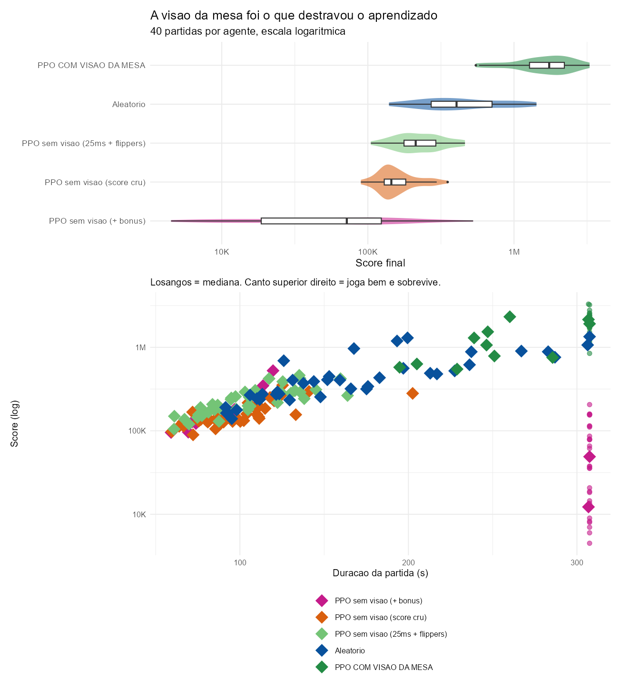
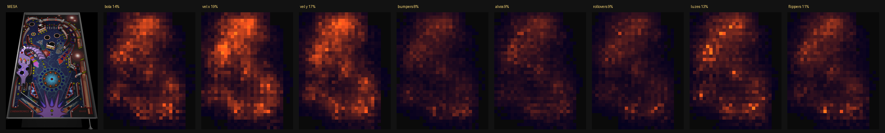
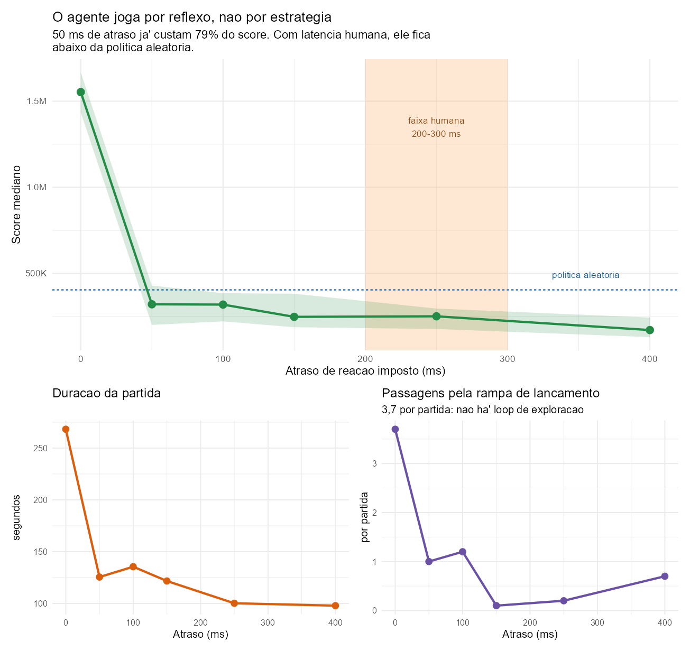
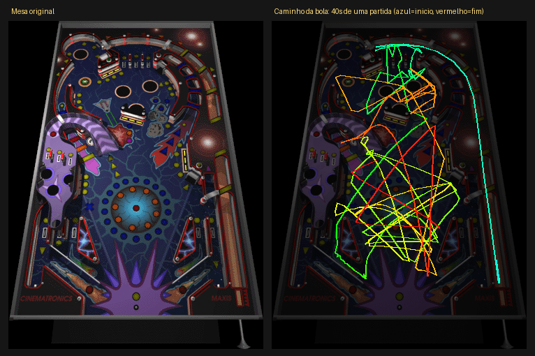
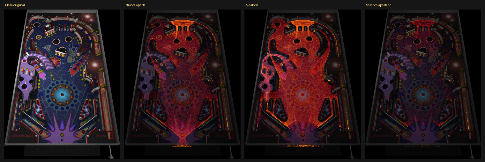
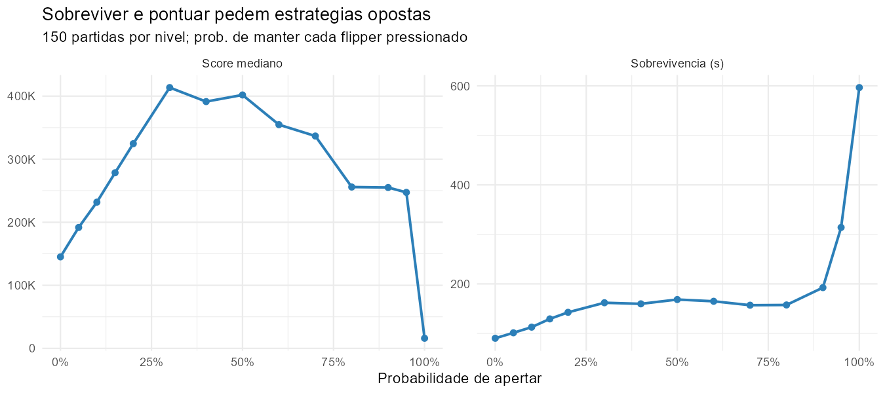

# Space Cadet Pinball como ambiente instrumentado

Experimento de engenharia reversa aplicada: transformar o *3D Pinball for
Windows - Space Cadet* num ambiente que gera dados em massa, para depois
treinar e **analisar estatisticamente** um agente.

> **Status: o agente aprendeu a rebater - por reflexo, nao por estrategia.**
> Um PPO com visao da mesa supera a politica aleatoria em **4,3x**
> (1.740.875 contra 404.375, Mann-Whitney p = 5,7e-15).

## O resultado

| Agente | Score mediano | Duracao |
|---|---|---|
| **PPO com visao da mesa** | **1.740.875** | 292 s |
| Aleatorio | 404.375 | 173 s |
| PPO sem visao | 212.500 | 104 s |



Mesma arquitetura, mesma recompensa, mesmo algoritmo nos dois PPO. A unica
diferenca e' que um enxerga a mesa. Sem a visao o agente nao podia aprender a
mirar, porque os alvos nao existiam na percepcao dele.

O que a rede olha, por saliencia: velocidade da bola 35,6%, canais da mesa
39,4%, com as **luzes acesas pesando mais que qualquer objeto fixo** - sao o
unico canal dinamico, indicando quais missoes estao ativas.



## A ressalva que muda tudo

O agente faz 4,3x o acaso **com tempo de reacao zero**. Impondo atraso entre a
decisao e a acao:

| Atraso | Score | vs. acaso |
|---|---|---|
| 0 ms | 1.552.750 | 3,8x |
| 50 ms | 320.625 | 0,79x |
| **250 ms** (latencia humana) | **251.000** | **0,62x** |

Nao e' declinio gradual, e' um degrau: 50 ms - ainda 5x mais rapido que uma
pessoa - ja' custam 79% do score. **Com reflexos humanos, o agente joga pior que
apertar botoes ao acaso.**



A competencia dele e' motora, nao cognitiva. Isso e' coerente com tudo o mais
que medimos: nao completa missoes, nao fecha trincas do multiplicador, nao faz
*cradle* (parar a bola para mirar) mais que o acaso, e nao descobriu o loop de
pontuacao que as regras da mesa mencionam.

## O teto: quatro hipoteses, tres descartadas

| Hipotese | Como foi testada | Veredito |
|---|---|---|
| Percepcao | dar a mesa em grade | **era isso, em parte** - 4,3x |
| Escala | 2,5M / 5M / 7,5M passos | descartada (p = 0,55 e 0,48) |
| Incentivo | 3 shapings distintos | descartada |
| Memoria temporal | AUC com 1 a 16 quadros | descartada (+0,012, satura) |
| Algoritmo (off-policy) | - | bloqueada: buffer exigiria 68 GB |

## A infraestrutura que tornou isso possivel

| Metrica | Valor |
|---|---|
| Velocidade de simulacao | **941x tempo real** |
| Episodios por segundo | 5,6 |
| 1000 partidas completas | 3 minutos (46 h de tempo de jogo) |
| Determinismo | mesma semente produz CSV identico byte a byte |

Para comparacao, o projeto publico mais proximo
([space-cadet-nn](https://github.com/angelowilliams/space-cadet-nn)) leva
**20 minutos para 20 partidas** usando captura de tela.

## Estrutura

```text
SpaceCadetPinball/   decompilacao (k4zmu2a) + instrumentacao propria
  SpaceCadetPinball/rlmode.cpp    modo headless de coleta (~140 linhas)
analise/             scripts R e dados gerados
  dados/             CSVs das rodadas
  scripts/           utilitarios de conferencia em Python
docs-ai/             contexto para retomar o trabalho
```

## Como reproduzir

Compilar (precisa de Visual Studio 2022 e das libs SDL2 em `Libs/`):

```powershell
cd SpaceCadetPinball
cmake -S . -B build -G "Visual Studio 17 2022" -A x64
cmake --build build --config Release
```

Coletar dados (o `PINBALL.DAT` precisa estar junto do executavel):

```bash
cd SpaceCadetPinball/bin/Release
SDL_VIDEODRIVER=dummy ./SpaceCadetPinball.exe -rl-episodes 1000 -rl-seed 42 -rl-policy 1
```

Politicas: `0` nunca aperta, `1` aleatoria, `2` sempre apertado.
Adicione `-rl-trace 6` para gravar tambem a trajetoria (uma linha a cada 6
passos), ou `-rl-prob 30` para fixar a probabilidade de apertar em 30%.
As duas degeneradas existem como **controle**: se o input parar de chegar ao
jogo, as tres distribuicoes de score ficam iguais.

Analisar:

```bash
cd analise
Rscript baseline.R        # distribuicao do baseline aleatorio
Rscript validacao.R       # as tres politicas de controle
Rscript conflito.R        # varredura de agressividade
python validacao_visual.py  # densidade e trajetoria sobre a mesa
```

## Validacao

A trajetoria de uma partida sobre a mesa real. A bola sobe pelo canal do plunger
a direita (linha ciano, o inicio), curva no topo e entra na mesa - a fisica e' a
do jogo original, nao uma aproximacao.



Densidade de posicoes por politica: os obstaculos aparecem como regioes frias.



## O conflito entre sobreviver e pontuar

Varrendo a probabilidade de apertar o flipper de 0 a 100%:

| Prob. apertar | Score mediano | Duracao (s) |
|---|---|---|
| 0% | 145.125 | 90 |
| **30%** | **413.625** | 162 |
| 50% | 401.875 | 168 |
| 95% | 247.375 | 314 |
| 100% | **16.000** | **597** |



De 95% para 100% o score cai 15x e a duracao dobra. Travar os flippers e' um
ponto isolado, nao um atrator suave: o caminho ate' o otimo (~30%) e' um
gradiente monotono.

## Creditos

Construido sobre a decompilacao
[k4zmu2a/SpaceCadetPinball](https://github.com/k4zmu2a/SpaceCadetPinball).
A instrumentacao esta na branch `rl-instrumentation`, em um unico commit.
